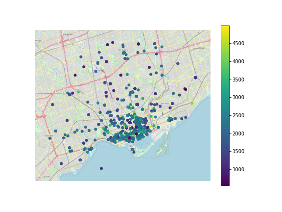

# Scraping Rental Data

This [code](scraping_example.py) scrapes rental data. For a given url, it scrapes all the listings of that area and produces a .csv file with rents, number of bedrooms, location, GPS coordinates, and distance to downtown.

Note that if the code loops over thousands of listings, this may take about 5-10 minutes to execute.

Then, it generates various statistics by the number of bedrooms as well as regresses rent on bedrooms and distance to downtown. When I ran the code on January 5th 2020 for Toronto I found that:
* An average studio in downtown Toronoto costs 1,950 dollars per month
* One additional bedroom raises your rent by 492 dollars per month
* If you move one km away from the downtown your rent is 37 dollars lower per month

Lastly, if you run this plotting [script](heat_map_example.py), you will get a heat map of all the rents around the city. Here is what I got when I ran the code on January 5th 2020:

You will need these packages:
* requests
* BeautifulSoup
* pandas
* numpy
* geopy
* sklearn
* statsmodels
* seaborn
